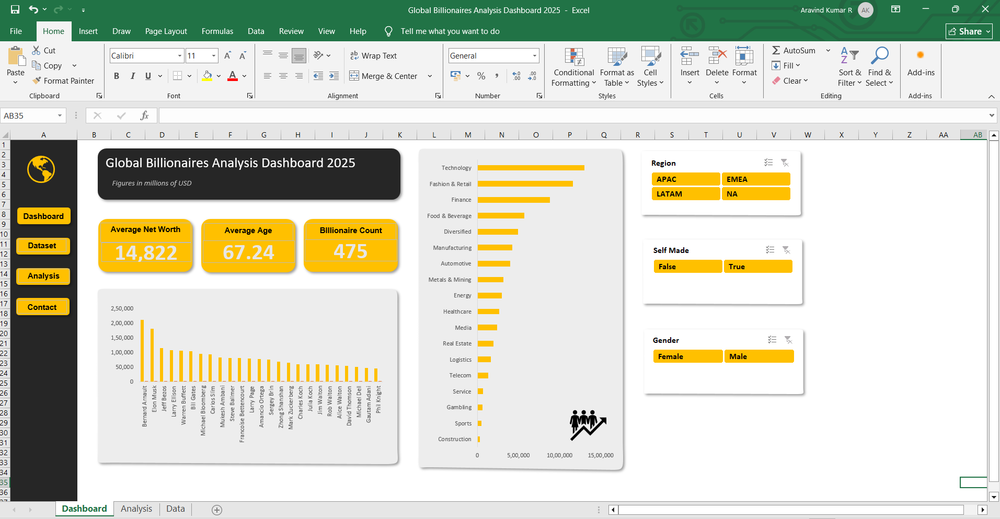

\# 💰 Global Billionaires Analysis Dashboard 2025

\---

\## 🚀 Transforming Global Wealth Data into Strategic Insights

An \*\*executive-level Global Billionaires Analysis Dashboard\*\* built using Microsoft Excel, designed to deliver actionable insights on \*\*wealth distribution, industry dominance, and regional concentration\*\*.

This project demonstrates the ability to convert raw financial data into a \*\*high-impact, interactive dashboard\*\* that enables stakeholders to analyze global wealth trends and make data-driven decisions.

\---

\## 🧩 Project Overview

The \*\*Global Billionaires Dashboard\*\* provides a 360° view of global wealth by integrating financial metrics, demographic insights, and industry analysis into a single, intuitive interface.

It empowers decision-makers to:

\- Analyze global wealth distribution across regions  

\- Identify top-performing industries  

\- Evaluate billionaire concentration by country  

\- Understand demographic patterns such as age and gender  

\- Make informed, data-driven strategic decisions  

\---

\## 🎯 Key Metrics Snapshot

| Metric                      | Value |

|----------------------------|------|

| 📊 Total Billionaires      | 497 |

| 💰 Average Net Worth       | 14,822 |

| 👤 Average Age             | 67.24 |

| 🌍 Global Coverage         | Multiple Regions |

\---

\## 📊 Dashboard Capabilities

✔ \*\*Wealth Distribution Analysis\*\* – Understand net worth patterns across individuals  

✔ \*\*Industry Analysis\*\* – Identify dominant sectors like Technology, Finance, and Retail  

✔ \*\*Regional Insights\*\* – Analyze billionaire concentration by country and region  

✔ \*\*Top Billionaires Ranking\*\* – Visualize highest net worth individuals  

✔ \*\*Demographic Analysis\*\* – Explore age, gender, and self-made status  

✔ \*\*Interactive Dashboard\*\* – Dynamic filtering and exploration using slicers  

\---

\## 📈 Key Business Insights

\### 🌍 Regional Analysis

\- Identified countries with the highest number of billionaires  

\- Wealth concentration is strongest in developed economies  

\- Emerging regions show potential for future growth  

\### 🏭 Industry Insights

\- Technology sector dominates billionaire creation  

\- Finance and Retail are major contributing industries  

\- Traditional industries show moderate representation  

\### 💰 Wealth Distribution

\- Significant gap between top billionaires and others  

\- Presence of extreme high-value outliers  

\- Wealth heavily concentrated among top individuals  

\### 🧠 Strategic Understanding

\- Wealth is concentrated in specific regions and industries  

\- Global inequality patterns are clearly visible  

\- Emerging markets present growth opportunities  

\---

\## 🛠 Tools \& Technologies

\- Microsoft Excel – Dashboard Development \& Visualization  

\- Pivot Tables – Data Aggregation  

\- Pivot Charts – Data Visualization  

\- Data Cleaning – Data Preparation  

\- Dashboard Design – UI/UX Structuring  

\- Git \& GitHub – Version Control \& Project Management  

\---

\## 📁 Dataset Details

\*\*Source File:\*\* `billionaires-data.xlsx`  

\*\*Records:\*\* 497 Billionaires  

\*\*Key Attributes:\*\*

\- Name  

\- Net Worth  

\- Country  

\- Industry  

\- Age  

\- Gender  

\- Self-Made Status  

\---

\## 💼 Business Value

This analysis helps:

✔ Understand global wealth distribution  

✔ Identify dominant industries  

✔ Support financial and economic research  

✔ Provide insights for investment strategies  

✔ Enable data-driven decision-making  

\---

\## 🧠 Skills Demonstrated

\- Data Cleaning \& Preparation  

\- Exploratory Data Analysis (EDA)  

\- Data Visualization \& Storytelling  

\- Dashboard Development  

\- Business Insight Generation  

\- Analytical Thinking  

\- GitHub Project Management  

\---

\## 🚀 Future Enhancements

\- 🔮 Build an interactive Power BI dashboard  

\- 🌐 Integrate real-time financial data  

\- 📊 Add time-based wealth trend analysis  

\- 🌍 Perform country-wise growth comparison  

\- 👥 Advanced segmentation and clustering  

\---

\_\_\_\_\_\_\_\_\_\_\_\_\_\_\_\_\_\_\_\_\_\_\_\_\_\_\_\_\_\_\_\_\_\_\_\_\_\_\_\_

\## 📂 Project Structure

| File/Folder | Description |

|------------|------------|

| billionaires-data.xlsx | Dataset |

| README.md | Project documentation |

| images/dashboard-preview.png | Dashboard screenshot |

\_\_\_\_\_\_\_\_\_\_\_\_\_\_\_\_\_\_\_\_\_\_\_\_\_\_\_\_\_\_\_\_\_\_\_\_\_\_\_\_

\## 🖼 Dashboard Preview

&#x20; 

\_\_\_\_\_\_\_\_\_\_\_\_\_\_\_\_\_\_\_\_\_\_\_\_\_\_\_\_\_\_\_\_\_\_\_\_\_\_\_\_

\## 👨‍💻 Author

\*\*Aravind Kumar R\*\*  

\*Data Analyst | Power BI Developer\*  

📊 Passionate about transforming data into actionable insights  

📈 Skilled in Data Analysis, Excel, and Business Intelligence  

🚀 Focused on solving real-world business problems using data  

\---

🔗 \*\*GitHub\*\*: https://github.com/Aravind-Kumar-27  

🔗 \*\*LinkedIn\*\*: \[Aravind Kumar](https://linkedin.com/in/r-aravind-kumar)  

📧 \*\*Email\*\*: r.aravindkumar27@gmail.com  

\_\_\_\_\_\_\_\_\_\_\_\_\_\_\_\_\_\_\_\_\_\_\_\_\_\_\_\_\_\_\_\_\_\_\_\_\_\_\_\_

\## ⭐ If you found this project useful

Give it a ⭐ on GitHub and feel free to connect!

\_\_\_\_\_\_\_\_\_\_\_\_\_\_\_\_\_\_\_\_\_\_\_\_\_\_\_\_\_\_\_\_\_\_\_\_\_\_\_\_

